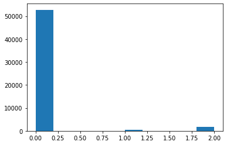

# Data mining vehicle sales data


```python
#Import libraries
import numpy as np
import pandas as pd
import matplotlib.pyplot as plt
import datetime as dt
```


```python
#Import data
df = pd.read_csv('AS24_Case_Study_Data.csv',delimiter=';')
```


```python
df.head()
```


<div>
<style scoped>
    .dataframe tbody tr th:only-of-type {
        vertical-align: middle;
    }

    .dataframe tbody tr th {
        vertical-align: top;
    }

    .dataframe thead th {
        text-align: right;
    }
</style>
<table border="1" class="dataframe">
  <thead>
    <tr style="text-align: right;">
      <th></th>
      <th>article_id</th>
      <th>product_tier</th>
      <th>make_name</th>
      <th>price</th>
      <th>first_zip_digit</th>
      <th>first_registration_year</th>
      <th>created_date</th>
      <th>deleted_date</th>
      <th>search_views</th>
      <th>detail_views</th>
      <th>stock_days</th>
      <th>ctr</th>
    </tr>
  </thead>
  <tbody>
    <tr>
      <th>0</th>
      <td>350625839</td>
      <td>Basic</td>
      <td>Mitsubishi</td>
      <td>16750</td>
      <td>5</td>
      <td>2013</td>
      <td>24.07.18</td>
      <td>24.08.18</td>
      <td>3091.0</td>
      <td>123.0</td>
      <td>30</td>
      <td>0.03780329990294403</td>
    </tr>
    <tr>
      <th>1</th>
      <td>354412280</td>
      <td>Basic</td>
      <td>Mercedes-Benz</td>
      <td>35950</td>
      <td>4</td>
      <td>2015</td>
      <td>16.08.18</td>
      <td>07.10.18</td>
      <td>3283.0</td>
      <td>223.0</td>
      <td>52</td>
      <td>0.06792567773378008</td>
    </tr>
    <tr>
      <th>2</th>
      <td>349572992</td>
      <td>Basic</td>
      <td>Mercedes-Benz</td>
      <td>11950</td>
      <td>3</td>
      <td>1998</td>
      <td>16.07.18</td>
      <td>05.09.18</td>
      <td>3247.0</td>
      <td>265.0</td>
      <td>51</td>
      <td>0.0816137973514013</td>
    </tr>
    <tr>
      <th>3</th>
      <td>350266763</td>
      <td>Basic</td>
      <td>Ford</td>
      <td>1750</td>
      <td>6</td>
      <td>2003</td>
      <td>20.07.18</td>
      <td>29.10.18</td>
      <td>1856.0</td>
      <td>26.0</td>
      <td>101</td>
      <td>0.014008620689655173</td>
    </tr>
    <tr>
      <th>4</th>
      <td>355688985</td>
      <td>Basic</td>
      <td>Mercedes-Benz</td>
      <td>26500</td>
      <td>3</td>
      <td>2014</td>
      <td>28.08.18</td>
      <td>08.09.18</td>
      <td>490.0</td>
      <td>20.0</td>
      <td>12</td>
      <td>0.04081632653061224</td>
    </tr>
  </tbody>
</table>
</div>


Description :

    article_id	             unique article identifier
    product_tier	           premium status of the article
    make_name	              name of the car manufacturer
    price	                  price of the article
    first_zip_digit	        first digit of the zip code of the region the article is offered in
    first_registration_year	year of the first registration of the article
    created_date	           creation date of the listing
    deleted_date	           deletion date of the listing
    search_views	           number of times the article has been shown as a search result
    detail_views	           number of times the article has been clicked on
    stock_days	             Time in days between the creation of the listing and the deletion of the listing
    ctr	                    Click through rate calculated as the quotient of detail_views over search_views


# Data Visualization

In this section we try to understand the data and its relationship to target variables.


```python
df.columns
```


    Index(['article_id', 'product_tier', 'make_name', 'price', 'first_zip_digit',
           'first_registration_year', 'created_date', 'deleted_date',
           'search_views', 'detail_views', 'stock_days', 'ctr'],
          dtype='object')


### 1. Visualize car_make data


```python
#Get the percentage of each car make in each product tier
plus_car = df.make_name.value_counts(normalize=True)
premium_car = df.make_name.value_counts(normalize=True)
basic_car = df.make_name.value_counts(normalize=True)
for car in df.make_name.value_counts().index :
    try: 
        plus_car[car]= df.make_name[df.product_tier =='Plus'].value_counts(normalize=True)[car]
    except:
        plus_car[car] = 0
        
        
    try: 
        premium_car[car]= df.make_name[df.product_tier =='Premium'].value_counts(normalize=True)[car]
    except:
        premium_car[car] = 0
        
                
    try: 
        basic_car[car]= df.make_name[df.product_tier =='Basic'].value_counts(normalize=True)[car]
    except:
        basic_car[car] = 0
```


```python
#Car make, instances, normalized

print('{:<15s} {:<10s} {:<20s} {:<20s} {:<20s}{:<20s}'.format('Car','Total','Normalized','Basic(Norm)','Plus(Norm)','Premium(Norm)'))
for car in df.make_name.value_counts().index:
    print('{:<15s} {:<10d} {:<20f}  {:<20f}  {:<20f}   {:<20f}'.format(car,
    df.make_name.value_counts()[car],                                      
    df.make_name.value_counts(normalize=True)[car],
    basic_car[car],
    plus_car[car],                                      
    premium_car[car]))


```

    Car             Total      Normalized           Basic(Norm)          Plus(Norm)          Premium(Norm)       
    Volkswagen      9430       0.120402              0.120020              0.133681               0.129518            
    Renault         6956       0.088814              0.090081              0.086806               0.048193            
    Peugeot         5446       0.069534              0.070193              0.050347               0.052926            
    Opel            5218       0.066623              0.067143              0.048611               0.054217            
    Ford            5199       0.066381              0.066865              0.045139               0.055938            
    Mercedes-Benz   4766       0.060852              0.060500              0.053819               0.074010            
    BMW             4554       0.058145              0.056947              0.052083               0.098537            
    Volvo           3994       0.050995              0.050516              0.055556               0.065404            
    Toyota          3924       0.050102              0.050371              0.055556               0.040017            
    Audi            3313       0.042300              0.041036              0.046875               0.082186            
    Citroen         3017       0.038521              0.038623              0.029514               0.037435            
    Fiat            2589       0.033056              0.033373              0.038194               0.021515            
    Nissan          2016       0.025740              0.025881              0.024306               0.021515            
    Kia             1931       0.024655              0.024993              0.017361               0.015491            
    Hyundai         1802       0.023008              0.023349              0.015625               0.013769            
    SEAT            1773       0.022638              0.022673              0.020833               0.021945            
    Skoda           1516       0.019356              0.019451              0.013889               0.017642            
    Suzuki          1312       0.016752              0.016786              0.036458               0.010757            
    MINI            1234       0.015756              0.015805              0.013889               0.014630            
    Mazda           1198       0.015296              0.015049              0.027778               0.020224            
    Mitsubishi      1067       0.013623              0.013590              0.012153               0.015060            
    Land Rover      545        0.006959              0.006775              0.010417               0.012048            
    Honda           538        0.006869              0.006656              0.017361               0.011188            
    Alfa Romeo      532        0.006793              0.006696              0.012153               0.008606            
    Porsche         524        0.006690              0.006616              0.010417               0.008176            
    Chevrolet       485        0.006192              0.006152              0.010417               0.006454            
    Dacia           440        0.005618              0.005675              0.005208               0.003873            
    Lexus           303        0.003869              0.003858              0.003472               0.004303            
    Jaguar          275        0.003511              0.003500              0.003472               0.003873            
    Iveco           222        0.002834              0.002890              0.000000               0.001721            
    Daihatsu        197        0.002515              0.002532              0.003472               0.001721            
    Saab            186        0.002375              0.002334              0.008681               0.002151            
    smart           183        0.002337              0.002413              0.000000               0.000430            
    Subaru          163        0.002081              0.002108              0.001736               0.001291            
    Jeep            160        0.002043              0.002015              0.005208               0.002151            
    Dodge           139        0.001775              0.001710              0.006944               0.002582            
    Chrysler        117        0.001494              0.001432              0.006944               0.002151            
    Oldtimer        108        0.001379              0.001405              0.000000               0.000861            
    Caravans-Wohnm  95         0.001213              0.001260              0.000000               0.000000            
    Daewoo          91         0.001162              0.001167              0.003472               0.000430            
    Tesla           84         0.001073              0.000941              0.000000               0.005594            
    Lancia          77         0.000983              0.000994              0.000000               0.000861            
    MG              70         0.000894              0.000902              0.000000               0.000861            
    DS Automobiles  51         0.000651              0.000663              0.001736               0.000000            
    Others          41         0.000523              0.000544              0.000000               0.000000            
    Triumph         38         0.000485              0.000504              0.000000               0.000000            
    Maserati        36         0.000460              0.000438              0.000000               0.001291            
    Bentley         35         0.000447              0.000438              0.003472               0.000000            
    Ferrari         31         0.000396              0.000411              0.000000               0.000000            
    SsangYong       27         0.000345              0.000318              0.000000               0.001291            
    Aixam           24         0.000306              0.000265              0.000000               0.001721            
    Rover           23         0.000294              0.000292              0.000000               0.000430            
    Cadillac        23         0.000294              0.000305              0.000000               0.000000            
    Aston Martin    22         0.000281              0.000278              0.001736               0.000000            
    Abarth          21         0.000268              0.000278              0.000000               0.000000            
    Trucks-Lkw      18         0.000230              0.000239              0.000000               0.000000            
    Microcar        14         0.000179              0.000186              0.000000               0.000000            
    Austin          11         0.000140              0.000146              0.000000               0.000000            
    Lincoln         10         0.000128              0.000119              0.000000               0.000430            
    Ligier          10         0.000128              0.000133              0.000000               0.000000            
    Rolls-Royce     9          0.000115              0.000106              0.000000               0.000430            
    Infiniti        9          0.000115              0.000106              0.000000               0.000430            
    Isuzu           7          0.000089              0.000080              0.000000               0.000430            
    Alpina          7          0.000089              0.000080              0.001736               0.000000            
    Buick           6          0.000077              0.000053              0.001736               0.000430            
    Corvette        5          0.000064              0.000066              0.000000               0.000000            
    Daimler         4          0.000051              0.000053              0.000000               0.000000            
    GMC             4          0.000051              0.000053              0.000000               0.000000            
    Pontiac         4          0.000051              0.000053              0.000000               0.000000            
    HUMMER          4          0.000051              0.000040              0.000000               0.000430            
    De Tomaso       4          0.000051              0.000053              0.000000               0.000000            
    FISKER          4          0.000051              0.000053              0.000000               0.000000            
    Lamborghini     3          0.000038              0.000027              0.001736               0.000000            
    Lotus           3          0.000038              0.000040              0.000000               0.000000            
    Alpine          3          0.000038              0.000040              0.000000               0.000000            
    Oldsmobile      3          0.000038              0.000040              0.000000               0.000000            
    McLaren         2          0.000026              0.000027              0.000000               0.000000            
    Morgan          2          0.000026              0.000027              0.000000               0.000000            
    Chatenet        2          0.000026              0.000027              0.000000               0.000000            
    Donkervoort     1          0.000013              0.000013              0.000000               0.000000            
    AC              1          0.000013              0.000013              0.000000               0.000000            
    Tata            1          0.000013              0.000000              0.000000               0.000430            
    DFSK            1          0.000013              0.000013              0.000000               0.000000            
    Grecav          1          0.000013              0.000013              0.000000               0.000000            
    Piaggio         1          0.000013              0.000013              0.000000               0.000000            
    Kawasaki        1          0.000013              0.000013              0.000000               0.000000            
    Amphicar        1          0.000013              0.000013              0.000000               0.000000            
    TVR             1          0.000013              0.000013              0.000000               0.000000            
    MAN             1          0.000013              0.000013              0.000000               0.000000            
    KTM             1          0.000013              0.000013              0.000000               0.000000            
    Casalini        1          0.000013              0.000013              0.000000               0.000000            
    

From the above data it can be inferred that the normalized car count, Basic tier count, Plus tier count and Premium tier count is almost same. 
There is no evidence of any particular car make being preferred over other for product tier.

### 2. Visualize product tier information


```python
#Encode the product_tier
df['product_tier'] = df.product_tier.astype('category').cat.codes
```


```python
#plot histogram of product tier
plt.hist(df.product_tier)
```


    (array([75421.,     0.,     0.,     0.,     0.,   576.,     0.,     0.,
                0.,  2324.]),
     array([0. , 0.2, 0.4, 0.6, 0.8, 1. , 1.2, 1.4, 1.6, 1.8, 2. ]),
     <a list of 10 Patch objects>)


The classes are imbalanced. A "naive" classifier which predicts every data as product tier "Basic" will have accuracy of 96.32%. Hence the model should improve F1 score from 0.33 and accuracy above 96.32%

### 3. Search and Detail views 


```python
#search view vs detail view
plt.scatter(df.search_views,df.detail_views,c=df.product_tier)
plt.xlabel('Search views')
plt.ylabel('Detail views')
```


    Text(0, 0.5, 'Detail views')


```python
#same plot but with search views limited to a range.
plt.scatter(df.search_views,df.detail_views,c=df.product_tier)
plt.xlim(0,200000)
plt.xlabel('Search views')
plt.ylabel('Detail views')
```


    Text(0, 0.5, 'Detail views')


```python
# search view vs logged detail view
plt.scatter(df.search_views,np.log(df.detail_views),c=df.product_tier)
plt.xlim(0,200000)
plt.xlabel('Search views')
plt.ylabel('Detail views(log)')
```

    C:\Users\surao\AppData\Local\Continuum\anaconda3\envs\sudu_env\lib\site-packages\pandas\core\series.py:679: RuntimeWarning: divide by zero encountered in log
      result = getattr(ufunc, method)(*inputs, **kwargs)
    


    Text(0, 0.5, 'Detail views(log)')


```python
# logged search view vs detail view.
plt.scatter(np.log(df.search_views),df.detail_views,c=df.product_tier)
plt.xlabel('Search views(log)')
plt.ylabel('Detail views')
```


    Text(0, 0.5, 'Detail views')


the 'ctr' is evaluated as ratio of detail views and search views. As the data is not proper, evaluate again.


```python
df.ctr = df.detail_views/df.search_views
plt.scatter(df.ctr,df.search_views,c=df.product_tier)
```


    <matplotlib.collections.PathCollection at 0x1b2c8abf9b0>


From above plots it can be seen that the Premium product tier froms a cluster at high search views and low detail views. Plus product tier does not form any cluster.

### 4. First registration year and Price


```python
#Visualizing the first registration year
plt.scatter(df.first_registration_year,df.product_tier)
plt.xlim(1920,2025)
plt.xlabel('Year')
plt.ylabel('Product tier')
```


    Text(0, 0.5, 'Product tier')


From above plot we can see that the Premium and Plus product tier is assigned to cars from 1970 onwards and no further information about the distribution is available. 
Additionally, a new attribute age of car can be created which can help in classification.


```python
#Visualizing the first registration year and price
plt.scatter(df.first_registration_year,df.price,c=df.product_tier)
plt.xlim(1920,2025)
plt.xlabel('Year')
plt.ylabel('Price')
```


    Text(0, 0.5, 'Price')


Some New cars, 20 year old cars and around 50 year old cars have high price. However there seems to be  no relation in terms of product tier and price.


```python
#Visualizing the search views and price
plt.scatter(df.search_views,df.price,c=df.product_tier)
plt.xlim(0,300000)
plt.xlabel('Search views')
plt.ylabel('Price')
```


    Text(0, 0.5, 'Price')


Premium product tier cars are majorly within 50000, however most of the cars are in the same price range.


```python
#Visualizing the search views and price(logged)
plt.scatter(df.search_views,np.log(df.price),c=df.product_tier)
plt.xlim(0,300000)
plt.xlabel('Search views')
plt.ylabel('Price(log)')
```


    Text(0, 0.5, 'Price(log)')


From above plot we do not see any evidence of relation between price and product tier.

### 5. Stock days.


```python
#Visualizing the stock days vs search views logged
plt.scatter(np.log(df.search_views),df.stock_days,c=df.product_tier)
#plt.xlim(0,300000)
plt.xlabel('Search views(log)')
plt.ylabel('Stock days')
```


    Text(0, 0.5, 'Stock days')


There seems to be not much relation between stock days and product tier.

### 6. First zip digit 


```python
plt.scatter(df.first_zip_digit,np.log(df.search_views),c=df.product_tier)
```


    <matplotlib.collections.PathCollection at 0x1b2ca022c18>


```python
plt.hist(df.first_zip_digit,rwidth=0.25,align='mid')

```


    (array([ 7704.,  9711., 13342.,  6758.,     0., 12166.,  7255., 11006.,
             6205.,  4174.]),
     array([1. , 1.8, 2.6, 3.4, 4.2, 5. , 5.8, 6.6, 7.4, 8.2, 9. ]),
     <a list of 10 Patch objects>)


```python
plt.hist(df.first_zip_digit[df.product_tier==2],rwidth=0.25,align='mid')

```


    (array([141., 728., 345., 107.,   0., 281., 107., 306., 259.,  50.]),
     array([1. , 1.8, 2.6, 3.4, 4.2, 5. , 5.8, 6.6, 7.4, 8.2, 9. ]),
     <a list of 10 Patch objects>)


From above histogram, it can be seen that the ratio of premium car to total car sale is high in city with first digit of zip code 3 and low in city with first digit of zip code as 7

# Data Preprocessing

Create a new dataframe which is preprocessed and in right format for ML models.

article_id does not have any meaningful information and hence can be removed.


```python
df_pp = df.drop(['article_id'],axis=1)
```

Create new attribute 'car_age' which is age of car when record is created.


```python
df_pp.created_date = pd.to_datetime(df.created_date)
df_pp.created_date = df_pp['created_date'].dt.year
df_pp.loc[:,'car_age'] = df_pp.created_date -df_pp.first_registration_year
df_pp.car_age  = np.where(df_pp.car_age < 1 , 1,df_pp.car_age)
```


```python
# Remove attributes which does not have correlation with product_tier
df_pp = df_pp.drop(['make_name'],axis=1)
df_pp = df_pp.drop(['first_zip_digit'],axis=1)
#df_pp =pd.get_dummies(df_pp,columns=['first_zip_digit'])
df_pp = df_pp.drop(['first_registration_year'],axis=1)
df_pp = df_pp.drop(['created_date'],axis=1)
df_pp = df_pp.drop(['deleted_date'],axis=1)
```


```python
df_pp.stock_days  = np.where(df_pp.stock_days < 0 , 0,df_pp.stock_days)
```


```python
df_pp = df_pp[~np.isnan(df_pp).any(axis=1)]
```


```python
df_pp.head()
```


<div>
<style scoped>
    .dataframe tbody tr th:only-of-type {
        vertical-align: middle;
    }

    .dataframe tbody tr th {
        vertical-align: top;
    }

    .dataframe thead th {
        text-align: right;
    }
</style>
<table border="1" class="dataframe">
  <thead>
    <tr style="text-align: right;">
      <th></th>
      <th>product_tier</th>
      <th>price</th>
      <th>search_views</th>
      <th>detail_views</th>
      <th>stock_days</th>
      <th>ctr</th>
      <th>car_age</th>
    </tr>
  </thead>
  <tbody>
    <tr>
      <th>0</th>
      <td>0</td>
      <td>16750</td>
      <td>3091.0</td>
      <td>123.0</td>
      <td>30</td>
      <td>0.039793</td>
      <td>5</td>
    </tr>
    <tr>
      <th>1</th>
      <td>0</td>
      <td>35950</td>
      <td>3283.0</td>
      <td>223.0</td>
      <td>52</td>
      <td>0.067926</td>
      <td>3</td>
    </tr>
    <tr>
      <th>2</th>
      <td>0</td>
      <td>11950</td>
      <td>3247.0</td>
      <td>265.0</td>
      <td>51</td>
      <td>0.081614</td>
      <td>20</td>
    </tr>
    <tr>
      <th>3</th>
      <td>0</td>
      <td>1750</td>
      <td>1856.0</td>
      <td>26.0</td>
      <td>101</td>
      <td>0.014009</td>
      <td>15</td>
    </tr>
    <tr>
      <th>4</th>
      <td>0</td>
      <td>26500</td>
      <td>490.0</td>
      <td>20.0</td>
      <td>12</td>
      <td>0.040816</td>
      <td>4</td>
    </tr>
  </tbody>
</table>
</div>


```python
df_pp.describe()
```


<div>
<style scoped>
    .dataframe tbody tr th:only-of-type {
        vertical-align: middle;
    }

    .dataframe tbody tr th {
        vertical-align: top;
    }

    .dataframe thead th {
        text-align: right;
    }
</style>
<table border="1" class="dataframe">
  <thead>
    <tr style="text-align: right;">
      <th></th>
      <th>product_tier</th>
      <th>price</th>
      <th>search_views</th>
      <th>detail_views</th>
      <th>stock_days</th>
      <th>ctr</th>
      <th>car_age</th>
    </tr>
  </thead>
  <tbody>
    <tr>
      <th>count</th>
      <td>78297.000000</td>
      <td>78297.000000</td>
      <td>78297.00000</td>
      <td>78297.000000</td>
      <td>78297.000000</td>
      <td>78297.000000</td>
      <td>78297.000000</td>
    </tr>
    <tr>
      <th>mean</th>
      <td>0.066720</td>
      <td>15069.670358</td>
      <td>2297.91333</td>
      <td>93.486583</td>
      <td>35.996373</td>
      <td>0.046892</td>
      <td>7.000485</td>
    </tr>
    <tr>
      <th>std</th>
      <td>0.348761</td>
      <td>16375.598837</td>
      <td>6339.52668</td>
      <td>228.042547</td>
      <td>32.211601</td>
      <td>0.038818</td>
      <td>6.440443</td>
    </tr>
    <tr>
      <th>min</th>
      <td>0.000000</td>
      <td>50.000000</td>
      <td>1.00000</td>
      <td>0.000000</td>
      <td>0.000000</td>
      <td>0.000000</td>
      <td>1.000000</td>
    </tr>
    <tr>
      <th>25%</th>
      <td>0.000000</td>
      <td>5750.000000</td>
      <td>368.00000</td>
      <td>13.000000</td>
      <td>10.000000</td>
      <td>0.024263</td>
      <td>3.000000</td>
    </tr>
    <tr>
      <th>50%</th>
      <td>0.000000</td>
      <td>10909.000000</td>
      <td>920.00000</td>
      <td>36.000000</td>
      <td>25.000000</td>
      <td>0.038239</td>
      <td>5.000000</td>
    </tr>
    <tr>
      <th>75%</th>
      <td>0.000000</td>
      <td>18890.000000</td>
      <td>2234.00000</td>
      <td>94.000000</td>
      <td>55.000000</td>
      <td>0.058687</td>
      <td>10.000000</td>
    </tr>
    <tr>
      <th>max</th>
      <td>2.000000</td>
      <td>249888.000000</td>
      <td>608754.00000</td>
      <td>13926.000000</td>
      <td>127.000000</td>
      <td>1.833333</td>
      <td>94.000000</td>
    </tr>
  </tbody>
</table>
</div>


```python
df_pp.corr()
```


<div>
<style scoped>
    .dataframe tbody tr th:only-of-type {
        vertical-align: middle;
    }

    .dataframe tbody tr th {
        vertical-align: top;
    }

    .dataframe thead th {
        text-align: right;
    }
</style>
<table border="1" class="dataframe">
  <thead>
    <tr style="text-align: right;">
      <th></th>
      <th>product_tier</th>
      <th>price</th>
      <th>search_views</th>
      <th>detail_views</th>
      <th>stock_days</th>
      <th>ctr</th>
      <th>car_age</th>
    </tr>
  </thead>
  <tbody>
    <tr>
      <th>product_tier</th>
      <td>1.000000</td>
      <td>-0.007658</td>
      <td>0.315866</td>
      <td>0.244744</td>
      <td>-0.011465</td>
      <td>-0.051979</td>
      <td>0.022855</td>
    </tr>
    <tr>
      <th>price</th>
      <td>-0.007658</td>
      <td>1.000000</td>
      <td>0.002961</td>
      <td>0.028855</td>
      <td>0.085730</td>
      <td>0.003768</td>
      <td>-0.299590</td>
    </tr>
    <tr>
      <th>search_views</th>
      <td>0.315866</td>
      <td>0.002961</td>
      <td>1.000000</td>
      <td>0.835632</td>
      <td>0.271679</td>
      <td>-0.057980</td>
      <td>0.110189</td>
    </tr>
    <tr>
      <th>detail_views</th>
      <td>0.244744</td>
      <td>0.028855</td>
      <td>0.835632</td>
      <td>1.000000</td>
      <td>0.281627</td>
      <td>0.102228</td>
      <td>0.122142</td>
    </tr>
    <tr>
      <th>stock_days</th>
      <td>-0.011465</td>
      <td>0.085730</td>
      <td>0.271679</td>
      <td>0.281627</td>
      <td>1.000000</td>
      <td>-0.147767</td>
      <td>-0.079362</td>
    </tr>
    <tr>
      <th>ctr</th>
      <td>-0.051979</td>
      <td>0.003768</td>
      <td>-0.057980</td>
      <td>0.102228</td>
      <td>-0.147767</td>
      <td>1.000000</td>
      <td>0.050117</td>
    </tr>
    <tr>
      <th>car_age</th>
      <td>0.022855</td>
      <td>-0.299590</td>
      <td>0.110189</td>
      <td>0.122142</td>
      <td>-0.079362</td>
      <td>0.050117</td>
      <td>1.000000</td>
    </tr>
  </tbody>
</table>
</div>


```python
#df_pp = df_pp.drop(['price'],axis=1)
#df_pp = df_pp.drop(['stock_days'],axis=1)
#df_pp = df_pp.drop(['ctr'],axis=1)
```

# ML models

In this section, we look at various ML classification algorithm and different methodology.


```python
from sklearn.model_selection import train_test_split
from sklearn import preprocessing
```


```python
from sklearn.naive_bayes import GaussianNB
from sklearn.neighbors import KNeighborsClassifier
from sklearn.tree import DecisionTreeClassifier
from sklearn.svm import SVC
from sklearn.neural_network import MLPClassifier
from sklearn.metrics import accuracy_score,f1_score
from sklearn.metrics import confusion_matrix
```


```python
X,y = df_pp.drop(['product_tier'],axis=1),df_pp.product_tier

```


```python
X = pd.DataFrame(preprocessing.MinMaxScaler().fit_transform(X.select_dtypes(np.number)))
```


```python
X_train,X_test,y_train,y_test = train_test_split(X,y,test_size=0.3,random_state=200920)
```


```python
def evaluate_classifier(c_name,c,X_train,y_train,X_test,y_test,view_cm = False):
    y_pred = c.fit(X_train,y_train).predict(X_test)
    acc = accuracy_score(y_test,y_pred)
    f1  = f1_score(y_test,y_pred,average='macro')
    print(f'{c_name}: ACC={acc:.4f}, F1={f1:.4f}')
    
    if(view_cm):
        cm = confusion_matrix(y_test, y_pred) 

        labels = ['Basic', 'Plus','Premium']
        fig = plt.figure()
        ax = fig.add_subplot(111)
        for ij,v in np.ndenumerate(cm):
            i,j = ij
            plt.text(j,i,str(v),color="white",ha="center",va="center")
        cax = ax.matshow(cm)
        plt.title('Confusion matrix of the classifier {}'.format(c_name))
        fig.colorbar(cax)
        ax.set_xticklabels([''] + labels)
        ax.set_yticklabels([''] + labels)
        plt.xlabel('Predicted')
        plt.ylabel('True')
        plt.show()
 
  

```


```python
estimators = {
    'k-NN-1': KNeighborsClassifier(n_neighbors=1),
    'k-NN-3': KNeighborsClassifier(n_neighbors=3),
    'k-NN-5': KNeighborsClassifier(n_neighbors=5),
    'k-NN-9': KNeighborsClassifier(n_neighbors=9),
    'DT': DecisionTreeClassifier(),
    'SVM': SVC(),
    'NB': GaussianNB(),
    'NN': MLPClassifier()
}

```


```python
for c_name,c in estimators.items():
    evaluate_classifier(c_name,c,X_train,y_train,X_test,y_test)
```

    k-NN-1: ACC=0.9551, F1=0.4546
    k-NN-3: ACC=0.9662, F1=0.4512
    k-NN-5: ACC=0.9669, F1=0.4408
    k-NN-9: ACC=0.9666, F1=0.4268
    DT: ACC=0.9516, F1=0.4811
    SVM: ACC=0.9646, F1=0.3815
    NB: ACC=0.9573, F1=0.4389
    NN: ACC=0.9708, F1=0.5094
    


```python
#Confusion matrix of multi layer perceptron classifier.
evaluate_classifier('NN',MLPClassifier(),X_train,y_train,X_test,y_test,view_cm=True)
```

    NN: ACC=0.9713, F1=0.5146
    


We see that performance of the model is good for class 'Basic' and average for 'Premium'. As expected, the 'Plus' product tier has the worst performance.

# Oversampling

We saw that the classes are imblalanced. We try oversampling the minority classes to see if it improves the performance. SMOTE and RandomOverSampler are used. As RandomOverSampler provided better performance, the same is shown.


```python
from imblearn.over_sampling import SMOTE
from imblearn.over_sampling import RandomOverSampler

#smote = SMOTE('not majority')
#X_sm,y_sm = smote.fit_sample(X_train,y_train)

ros = RandomOverSampler('not majority')
X_sm,y_sm = ros.fit_sample(X_train,y_train)
```

    C:\Users\surao\AppData\Local\Continuum\anaconda3\envs\sudu_env\lib\site-packages\imblearn\utils\_validation.py:638: FutureWarning: Pass sampling_strategy=not majority as keyword args. From version 0.9 passing these as positional arguments will result in an error
      FutureWarning)
    


```python
plt.hist(y_train)
```


    (array([52789.,     0.,     0.,     0.,     0.,   404.,     0.,     0.,
                0.,  1614.]),
     array([0. , 0.2, 0.4, 0.6, 0.8, 1. , 1.2, 1.4, 1.6, 1.8, 2. ]),
     <a list of 10 Patch objects>)





```python
plt.hist(y_sm)
```


    (array([52789.,     0.,     0.,     0.,     0., 52789.,     0.,     0.,
                0., 52789.]),
     array([0. , 0.2, 0.4, 0.6, 0.8, 1. , 1.2, 1.4, 1.6, 1.8, 2. ]),
     <a list of 10 Patch objects>)


```python
for c_name,c in estimators.items():
    evaluate_classifier(c_name,c,X_sm,y_sm,X_test,y_test)
```

    k-NN-1: ACC=0.9551, F1=0.4546
    k-NN-3: ACC=0.9430, F1=0.4599
    k-NN-5: ACC=0.9293, F1=0.4549
    k-NN-9: ACC=0.9027, F1=0.4351
    DT: ACC=0.9544, F1=0.4831
    SVM: ACC=0.8715, F1=0.5118
    NB: ACC=0.8802, F1=0.4253
    NN: ACC=0.8242, F1=0.4678
    

    C:\Users\surao\AppData\Local\Continuum\anaconda3\envs\sudu_env\lib\site-packages\sklearn\neural_network\_multilayer_perceptron.py:585: ConvergenceWarning: Stochastic Optimizer: Maximum iterations (200) reached and the optimization hasn't converged yet.
      % self.max_iter, ConvergenceWarning)
    

Oversampling does not seem to have improved the performance.

# Bagging

Ensemble techniques are used to check if it improves the model performance.


```python
from sklearn.ensemble import BaggingClassifier
from sklearn.ensemble import RandomForestClassifier

bagging_estimators = {f'{c_name} (B)': BaggingClassifier(c) for c_name, c in estimators.items()}
estimators.update(bagging_estimators)
estimators['RF'] = RandomForestClassifier()

for c_name, c in estimators.items():
    evaluate_classifier(c_name, c, X_train, y_train, X_test, y_test)

```

    k-NN-1: ACC=0.9551, F1=0.4546
    k-NN-3: ACC=0.9662, F1=0.4512
    k-NN-5: ACC=0.9669, F1=0.4408
    k-NN-9: ACC=0.9666, F1=0.4268
    DT: ACC=0.9505, F1=0.4766
    SVM: ACC=0.9646, F1=0.3815
    NB: ACC=0.9573, F1=0.4389
    NN: ACC=0.9710, F1=0.5111
    k-NN-1 (B): ACC=0.9573, F1=0.4462
    k-NN-3 (B): ACC=0.9658, F1=0.4521
    k-NN-5 (B): ACC=0.9662, F1=0.4350
    k-NN-9 (B): ACC=0.9665, F1=0.4241
    DT (B): ACC=0.9691, F1=0.5016
    SVM (B): ACC=0.9645, F1=0.3783
    NB (B): ACC=0.9567, F1=0.4336
    

    C:\Users\surao\AppData\Local\Continuum\anaconda3\envs\sudu_env\lib\site-packages\sklearn\neural_network\_multilayer_perceptron.py:585: ConvergenceWarning: Stochastic Optimizer: Maximum iterations (200) reached and the optimization hasn't converged yet.
      % self.max_iter, ConvergenceWarning)
    

    NN (B): ACC=0.9708, F1=0.5105
    RF: ACC=0.9710, F1=0.5123
    

Random forest perfomance is good, but the F1 score has deteriorated.

# Boosting

Various Boosting methods are evaluated.


```python
from sklearn.ensemble import AdaBoostClassifier
from xgboost import XGBClassifier

estimators['AdaBoost'] = AdaBoostClassifier()
estimators['XGBoost'] = XGBClassifier()

for c_name, c in estimators.items():
    evaluate_classifier(c_name, c, X_train, y_train, X_test, y_test)

```

    k-NN-1: ACC=0.9551, F1=0.4546
    k-NN-3: ACC=0.9662, F1=0.4512
    k-NN-5: ACC=0.9669, F1=0.4408
    k-NN-9: ACC=0.9666, F1=0.4268
    DT: ACC=0.9512, F1=0.4788
    SVM: ACC=0.9646, F1=0.3815
    NB: ACC=0.9573, F1=0.4389
    NN: ACC=0.9711, F1=0.5126
    k-NN-1 (B): ACC=0.9580, F1=0.4524
    k-NN-3 (B): ACC=0.9654, F1=0.4440
    k-NN-5 (B): ACC=0.9672, F1=0.4452
    k-NN-9 (B): ACC=0.9665, F1=0.4246
    DT (B): ACC=0.9697, F1=0.5086
    SVM (B): ACC=0.9646, F1=0.3800
    NB (B): ACC=0.9581, F1=0.4342
    NN (B): ACC=0.9709, F1=0.5099
    RF: ACC=0.9708, F1=0.5117
    AdaBoost: ACC=0.9693, F1=0.4904
    XGBoost: ACC=0.9718, F1=0.5220
    

XGBoost perfomance is good. A closer look at the confusion matrix :


```python
#Confusion matrix of multi layer perceptron classifier.
evaluate_classifier('XGBoost',XGBClassifier(),X_train,y_train,X_test,y_test,view_cm=True)
```

    XGBoost: ACC=0.9718, F1=0.5220
    


# Stacking

We try stacking of various algorithm to see if it improves the performance.


```python
from mlens.ensemble import SuperLearner

best_estimators = {
#    'k-NN-1': KNeighborsClassifier(n_neighbors=1),
    'k-NN-3': KNeighborsClassifier(n_neighbors=3),
#    'k-NN-5': KNeighborsClassifier(n_neighbors=5),
    'DT': DecisionTreeClassifier(),
#    'SVM': SVC(),
    'NB': GaussianNB(),
    'NN': MLPClassifier()
}


#encoder = LabelEncoder()
#y_train_encoded = encoder.fit_transform(y_train)
#y_test_encoded = encoder.transform(y_test)

ensemble = SuperLearner()
ensemble.add(list(best_estimators.values()))
ensemble.add_meta(DecisionTreeClassifier())
best_estimators['Stacking'] = ensemble

for c_name, c in best_estimators.items():
    evaluate_classifier(c_name, c, X_train, y_train, X_test, y_test)


```

    [MLENS] backend: threading
    

    k-NN-3: ACC=0.9662, F1=0.4512
    DT: ACC=0.9516, F1=0.4798
    NB: ACC=0.9573, F1=0.4389
    NN: ACC=0.9709, F1=0.5120
    

    C:\Users\surao\AppData\Local\Continuum\anaconda3\envs\sudu_env\lib\site-packages\sklearn\neural_network\_multilayer_perceptron.py:585: ConvergenceWarning: Stochastic Optimizer: Maximum iterations (200) reached and the optimization hasn't converged yet.
      % self.max_iter, ConvergenceWarning)
    

    Stacking: ACC=0.9711, F1=0.5183
    

Stacking does not seem to have helped improve the performance.

The best performance is from XGBoost!

# Regression for Detail views

Determination of detail views is a regression task. We look at various regression model and its performance.


```python
from sklearn.model_selection import cross_validate
from sklearn.decomposition import PCA
from sklearn.model_selection import cross_val_score
    
def evaluate_regression(X: pd.DataFrame, y: pd.Series, estimators: dict):
    # --- SOLUTION ---
    for e_name, e in estimators.items():
        scores = cross_validate(e, X, y=y, scoring={'MSE': 'neg_mean_squared_error'}, cv=10)
        rmse = np.mean(np.sqrt(np.abs(scores['test_MSE'])))
        print('{}: RMSE={:.2f}'.format(e_name, rmse))

```


```python
from sklearn.svm import SVR
from sklearn import linear_model
from sklearn.neighbors import KNeighborsRegressor
from sklearn.tree import DecisionTreeRegressor


def evaluate_multiple(X: pd.DataFrame, y: pd.Series):
    regressors = {
        'Linear Regression': linear_model.LinearRegression(),
        'Ridge': linear_model.Ridge(),
        'Lasso': linear_model.Lasso(max_iter=5000),
        'ElasticNet': linear_model.ElasticNet(),
        #'SVR': SVR(gamma='scale'),
        'k-NN': KNeighborsRegressor(),
        'Decision Tree': DecisionTreeRegressor(max_depth=20)
    }
    evaluate_regression(X, y, regressors)

```

Create a new data frame for regression with preprocessing done similar to previous section.


```python
df_reg = df.drop(['article_id'],axis=1)
```


```python
df_reg.created_date = pd.to_datetime(df_reg.created_date)
df_reg.created_date = df_reg['created_date'].dt.year
df_reg.loc[:,'car_age'] = df_reg.created_date -df_reg.first_registration_year
df_reg.car_age  = np.where(df_reg.car_age < 1 , 1,df_reg.car_age)
```


```python
# Remove attributes which does not have correlation with detail views
#Preprocess attributes to categorical values or dummy variables.
#df_reg = df_pp.drop(['make_name'],axis=1)
df_reg['make_name'] = df_reg.make_name.astype('category').cat.codes
#df_reg = df_pp.drop(['first_zip_digit'],axis=1)
df_reg =pd.get_dummies(df_reg,columns=['first_zip_digit'])
df_reg = df_reg.drop(['first_registration_year'],axis=1)
df_reg = df_reg.drop(['created_date'],axis=1)
df_reg = df_reg.drop(['deleted_date'],axis=1)
```


```python
df_reg.stock_days  = np.where(df_reg.stock_days < 0 , 0,df_reg.stock_days)
```


```python
df_reg = df_reg[~np.isnan(df_reg).any(axis=1)]
```

As the field 'ctr' is ratio of detail views to search views, to prevent biasness, 'ctr' field is removed.


```python
df_reg = df_reg.drop(['ctr'],axis=1)
```


```python
df_reg.head()
```


<div>
<style scoped>
    .dataframe tbody tr th:only-of-type {
        vertical-align: middle;
    }

    .dataframe tbody tr th {
        vertical-align: top;
    }

    .dataframe thead th {
        text-align: right;
    }
</style>
<table border="1" class="dataframe">
  <thead>
    <tr style="text-align: right;">
      <th></th>
      <th>product_tier</th>
      <th>make_name</th>
      <th>price</th>
      <th>search_views</th>
      <th>detail_views</th>
      <th>stock_days</th>
      <th>car_age</th>
      <th>first_zip_digit_1</th>
      <th>first_zip_digit_2</th>
      <th>first_zip_digit_3</th>
      <th>first_zip_digit_4</th>
      <th>first_zip_digit_5</th>
      <th>first_zip_digit_6</th>
      <th>first_zip_digit_7</th>
      <th>first_zip_digit_8</th>
      <th>first_zip_digit_9</th>
    </tr>
  </thead>
  <tbody>
    <tr>
      <th>0</th>
      <td>0</td>
      <td>62</td>
      <td>16750</td>
      <td>3091.0</td>
      <td>123.0</td>
      <td>30</td>
      <td>5</td>
      <td>0</td>
      <td>0</td>
      <td>0</td>
      <td>0</td>
      <td>1</td>
      <td>0</td>
      <td>0</td>
      <td>0</td>
      <td>0</td>
    </tr>
    <tr>
      <th>1</th>
      <td>0</td>
      <td>60</td>
      <td>35950</td>
      <td>3283.0</td>
      <td>223.0</td>
      <td>52</td>
      <td>3</td>
      <td>0</td>
      <td>0</td>
      <td>0</td>
      <td>1</td>
      <td>0</td>
      <td>0</td>
      <td>0</td>
      <td>0</td>
      <td>0</td>
    </tr>
    <tr>
      <th>2</th>
      <td>0</td>
      <td>60</td>
      <td>11950</td>
      <td>3247.0</td>
      <td>265.0</td>
      <td>51</td>
      <td>20</td>
      <td>0</td>
      <td>0</td>
      <td>1</td>
      <td>0</td>
      <td>0</td>
      <td>0</td>
      <td>0</td>
      <td>0</td>
      <td>0</td>
    </tr>
    <tr>
      <th>3</th>
      <td>0</td>
      <td>33</td>
      <td>1750</td>
      <td>1856.0</td>
      <td>26.0</td>
      <td>101</td>
      <td>15</td>
      <td>0</td>
      <td>0</td>
      <td>0</td>
      <td>0</td>
      <td>0</td>
      <td>1</td>
      <td>0</td>
      <td>0</td>
      <td>0</td>
    </tr>
    <tr>
      <th>4</th>
      <td>0</td>
      <td>60</td>
      <td>26500</td>
      <td>490.0</td>
      <td>20.0</td>
      <td>12</td>
      <td>4</td>
      <td>0</td>
      <td>0</td>
      <td>1</td>
      <td>0</td>
      <td>0</td>
      <td>0</td>
      <td>0</td>
      <td>0</td>
      <td>0</td>
    </tr>
  </tbody>
</table>
</div>


```python
df_reg.describe()
```


<div>
<style scoped>
    .dataframe tbody tr th:only-of-type {
        vertical-align: middle;
    }

    .dataframe tbody tr th {
        vertical-align: top;
    }

    .dataframe thead th {
        text-align: right;
    }
</style>
<table border="1" class="dataframe">
  <thead>
    <tr style="text-align: right;">
      <th></th>
      <th>product_tier</th>
      <th>make_name</th>
      <th>price</th>
      <th>search_views</th>
      <th>detail_views</th>
      <th>stock_days</th>
      <th>car_age</th>
      <th>first_zip_digit_1</th>
      <th>first_zip_digit_2</th>
      <th>first_zip_digit_3</th>
      <th>first_zip_digit_4</th>
      <th>first_zip_digit_5</th>
      <th>first_zip_digit_6</th>
      <th>first_zip_digit_7</th>
      <th>first_zip_digit_8</th>
      <th>first_zip_digit_9</th>
    </tr>
  </thead>
  <tbody>
    <tr>
      <th>count</th>
      <td>78297.000000</td>
      <td>78297.000000</td>
      <td>78297.000000</td>
      <td>78297.00000</td>
      <td>78297.000000</td>
      <td>78297.000000</td>
      <td>78297.000000</td>
      <td>78297.000000</td>
      <td>78297.000000</td>
      <td>78297.000000</td>
      <td>78297.000000</td>
      <td>78297.000000</td>
      <td>78297.000000</td>
      <td>78297.000000</td>
      <td>78297.000000</td>
      <td>78297.000000</td>
    </tr>
    <tr>
      <th>mean</th>
      <td>0.066720</td>
      <td>57.725839</td>
      <td>15069.670358</td>
      <td>2297.91333</td>
      <td>93.486583</td>
      <td>35.996373</td>
      <td>7.000485</td>
      <td>0.098395</td>
      <td>0.124002</td>
      <td>0.170364</td>
      <td>0.086300</td>
      <td>0.155281</td>
      <td>0.092660</td>
      <td>0.140465</td>
      <td>0.079237</td>
      <td>0.053297</td>
    </tr>
    <tr>
      <th>std</th>
      <td>0.348761</td>
      <td>26.387580</td>
      <td>16375.598837</td>
      <td>6339.52668</td>
      <td>228.042547</td>
      <td>32.211601</td>
      <td>6.440443</td>
      <td>0.297849</td>
      <td>0.329586</td>
      <td>0.375955</td>
      <td>0.280808</td>
      <td>0.362174</td>
      <td>0.289957</td>
      <td>0.347471</td>
      <td>0.270110</td>
      <td>0.224627</td>
    </tr>
    <tr>
      <th>min</th>
      <td>0.000000</td>
      <td>0.000000</td>
      <td>50.000000</td>
      <td>1.00000</td>
      <td>0.000000</td>
      <td>0.000000</td>
      <td>1.000000</td>
      <td>0.000000</td>
      <td>0.000000</td>
      <td>0.000000</td>
      <td>0.000000</td>
      <td>0.000000</td>
      <td>0.000000</td>
      <td>0.000000</td>
      <td>0.000000</td>
      <td>0.000000</td>
    </tr>
    <tr>
      <th>25%</th>
      <td>0.000000</td>
      <td>33.000000</td>
      <td>5750.000000</td>
      <td>368.00000</td>
      <td>13.000000</td>
      <td>10.000000</td>
      <td>3.000000</td>
      <td>0.000000</td>
      <td>0.000000</td>
      <td>0.000000</td>
      <td>0.000000</td>
      <td>0.000000</td>
      <td>0.000000</td>
      <td>0.000000</td>
      <td>0.000000</td>
      <td>0.000000</td>
    </tr>
    <tr>
      <th>50%</th>
      <td>0.000000</td>
      <td>67.000000</td>
      <td>10909.000000</td>
      <td>920.00000</td>
      <td>36.000000</td>
      <td>25.000000</td>
      <td>5.000000</td>
      <td>0.000000</td>
      <td>0.000000</td>
      <td>0.000000</td>
      <td>0.000000</td>
      <td>0.000000</td>
      <td>0.000000</td>
      <td>0.000000</td>
      <td>0.000000</td>
      <td>0.000000</td>
    </tr>
    <tr>
      <th>75%</th>
      <td>0.000000</td>
      <td>78.000000</td>
      <td>18890.000000</td>
      <td>2234.00000</td>
      <td>94.000000</td>
      <td>55.000000</td>
      <td>10.000000</td>
      <td>0.000000</td>
      <td>0.000000</td>
      <td>0.000000</td>
      <td>0.000000</td>
      <td>0.000000</td>
      <td>0.000000</td>
      <td>0.000000</td>
      <td>0.000000</td>
      <td>0.000000</td>
    </tr>
    <tr>
      <th>max</th>
      <td>2.000000</td>
      <td>90.000000</td>
      <td>249888.000000</td>
      <td>608754.00000</td>
      <td>13926.000000</td>
      <td>127.000000</td>
      <td>94.000000</td>
      <td>1.000000</td>
      <td>1.000000</td>
      <td>1.000000</td>
      <td>1.000000</td>
      <td>1.000000</td>
      <td>1.000000</td>
      <td>1.000000</td>
      <td>1.000000</td>
      <td>1.000000</td>
    </tr>
  </tbody>
</table>
</div>


```python
df_reg.corr()
```


<div>
<style scoped>
    .dataframe tbody tr th:only-of-type {
        vertical-align: middle;
    }

    .dataframe tbody tr th {
        vertical-align: top;
    }

    .dataframe thead th {
        text-align: right;
    }
</style>
<table border="1" class="dataframe">
  <thead>
    <tr style="text-align: right;">
      <th></th>
      <th>product_tier</th>
      <th>make_name</th>
      <th>price</th>
      <th>search_views</th>
      <th>detail_views</th>
      <th>stock_days</th>
      <th>car_age</th>
      <th>first_zip_digit_1</th>
      <th>first_zip_digit_2</th>
      <th>first_zip_digit_3</th>
      <th>first_zip_digit_4</th>
      <th>first_zip_digit_5</th>
      <th>first_zip_digit_6</th>
      <th>first_zip_digit_7</th>
      <th>first_zip_digit_8</th>
      <th>first_zip_digit_9</th>
    </tr>
  </thead>
  <tbody>
    <tr>
      <th>product_tier</th>
      <td>1.000000</td>
      <td>-0.023863</td>
      <td>-0.007658</td>
      <td>0.315866</td>
      <td>0.244744</td>
      <td>-0.011465</td>
      <td>0.022855</td>
      <td>-0.021887</td>
      <td>0.098136</td>
      <td>-0.013148</td>
      <td>-0.027234</td>
      <td>-0.011647</td>
      <td>-0.026530</td>
      <td>-0.002086</td>
      <td>0.020753</td>
      <td>-0.027621</td>
    </tr>
    <tr>
      <th>make_name</th>
      <td>-0.023863</td>
      <td>1.000000</td>
      <td>-0.098111</td>
      <td>-0.050165</td>
      <td>-0.065955</td>
      <td>-0.027956</td>
      <td>-0.030594</td>
      <td>-0.011520</td>
      <td>-0.010296</td>
      <td>-0.010194</td>
      <td>0.011579</td>
      <td>-0.008721</td>
      <td>-0.005342</td>
      <td>0.019169</td>
      <td>0.006689</td>
      <td>0.016230</td>
    </tr>
    <tr>
      <th>price</th>
      <td>-0.007658</td>
      <td>-0.098111</td>
      <td>1.000000</td>
      <td>0.002961</td>
      <td>0.028855</td>
      <td>0.085730</td>
      <td>-0.299590</td>
      <td>0.044823</td>
      <td>-0.007639</td>
      <td>-0.011320</td>
      <td>0.005118</td>
      <td>0.003497</td>
      <td>0.026055</td>
      <td>-0.022554</td>
      <td>-0.007672</td>
      <td>-0.030835</td>
    </tr>
    <tr>
      <th>search_views</th>
      <td>0.315866</td>
      <td>-0.050165</td>
      <td>0.002961</td>
      <td>1.000000</td>
      <td>0.835632</td>
      <td>0.271679</td>
      <td>0.110189</td>
      <td>-0.008087</td>
      <td>0.023397</td>
      <td>0.003286</td>
      <td>-0.013502</td>
      <td>-0.002629</td>
      <td>-0.003536</td>
      <td>0.004924</td>
      <td>0.004450</td>
      <td>-0.016391</td>
    </tr>
    <tr>
      <th>detail_views</th>
      <td>0.244744</td>
      <td>-0.065955</td>
      <td>0.028855</td>
      <td>0.835632</td>
      <td>1.000000</td>
      <td>0.281627</td>
      <td>0.122142</td>
      <td>-0.002902</td>
      <td>0.008949</td>
      <td>0.002517</td>
      <td>-0.009597</td>
      <td>0.001914</td>
      <td>-0.001494</td>
      <td>0.009302</td>
      <td>0.001757</td>
      <td>-0.019157</td>
    </tr>
    <tr>
      <th>stock_days</th>
      <td>-0.011465</td>
      <td>-0.027956</td>
      <td>0.085730</td>
      <td>0.271679</td>
      <td>0.281627</td>
      <td>1.000000</td>
      <td>-0.079362</td>
      <td>0.022703</td>
      <td>0.016927</td>
      <td>0.008816</td>
      <td>0.006338</td>
      <td>-0.007180</td>
      <td>0.010001</td>
      <td>-0.034188</td>
      <td>-0.015661</td>
      <td>-0.007235</td>
    </tr>
    <tr>
      <th>car_age</th>
      <td>0.022855</td>
      <td>-0.030594</td>
      <td>-0.299590</td>
      <td>0.110189</td>
      <td>0.122142</td>
      <td>-0.079362</td>
      <td>1.000000</td>
      <td>-0.007968</td>
      <td>-0.030041</td>
      <td>0.007382</td>
      <td>-0.011930</td>
      <td>0.037700</td>
      <td>-0.002124</td>
      <td>-0.002787</td>
      <td>-0.004383</td>
      <td>0.008740</td>
    </tr>
    <tr>
      <th>first_zip_digit_1</th>
      <td>-0.021887</td>
      <td>-0.011520</td>
      <td>0.044823</td>
      <td>-0.008087</td>
      <td>-0.002902</td>
      <td>0.022703</td>
      <td>-0.007968</td>
      <td>1.000000</td>
      <td>-0.124291</td>
      <td>-0.149700</td>
      <td>-0.101527</td>
      <td>-0.141638</td>
      <td>-0.105569</td>
      <td>-0.133546</td>
      <td>-0.096910</td>
      <td>-0.078383</td>
    </tr>
    <tr>
      <th>first_zip_digit_2</th>
      <td>0.098136</td>
      <td>-0.010296</td>
      <td>-0.007639</td>
      <td>0.023397</td>
      <td>0.008949</td>
      <td>0.016927</td>
      <td>-0.030041</td>
      <td>-0.124291</td>
      <td>1.000000</td>
      <td>-0.170494</td>
      <td>-0.115629</td>
      <td>-0.161312</td>
      <td>-0.120233</td>
      <td>-0.152095</td>
      <td>-0.110370</td>
      <td>-0.089270</td>
    </tr>
    <tr>
      <th>first_zip_digit_3</th>
      <td>-0.013148</td>
      <td>-0.010194</td>
      <td>-0.011320</td>
      <td>0.003286</td>
      <td>0.002517</td>
      <td>0.008816</td>
      <td>0.007382</td>
      <td>-0.149700</td>
      <td>-0.170494</td>
      <td>1.000000</td>
      <td>-0.139267</td>
      <td>-0.194289</td>
      <td>-0.144813</td>
      <td>-0.183188</td>
      <td>-0.132934</td>
      <td>-0.107520</td>
    </tr>
    <tr>
      <th>first_zip_digit_4</th>
      <td>-0.027234</td>
      <td>0.011579</td>
      <td>0.005118</td>
      <td>-0.013502</td>
      <td>-0.009597</td>
      <td>0.006338</td>
      <td>-0.011930</td>
      <td>-0.101527</td>
      <td>-0.115629</td>
      <td>-0.139267</td>
      <td>1.000000</td>
      <td>-0.131766</td>
      <td>-0.098212</td>
      <td>-0.124238</td>
      <td>-0.090155</td>
      <td>-0.072920</td>
    </tr>
    <tr>
      <th>first_zip_digit_5</th>
      <td>-0.011647</td>
      <td>-0.008721</td>
      <td>0.003497</td>
      <td>-0.002629</td>
      <td>0.001914</td>
      <td>-0.007180</td>
      <td>0.037700</td>
      <td>-0.141638</td>
      <td>-0.161312</td>
      <td>-0.194289</td>
      <td>-0.131766</td>
      <td>1.000000</td>
      <td>-0.137014</td>
      <td>-0.173322</td>
      <td>-0.125774</td>
      <td>-0.101730</td>
    </tr>
    <tr>
      <th>first_zip_digit_6</th>
      <td>-0.026530</td>
      <td>-0.005342</td>
      <td>0.026055</td>
      <td>-0.003536</td>
      <td>-0.001494</td>
      <td>0.010001</td>
      <td>-0.002124</td>
      <td>-0.105569</td>
      <td>-0.120233</td>
      <td>-0.144813</td>
      <td>-0.098212</td>
      <td>-0.137014</td>
      <td>1.000000</td>
      <td>-0.129185</td>
      <td>-0.093746</td>
      <td>-0.075824</td>
    </tr>
    <tr>
      <th>first_zip_digit_7</th>
      <td>-0.002086</td>
      <td>0.019169</td>
      <td>-0.022554</td>
      <td>0.004924</td>
      <td>0.009302</td>
      <td>-0.034188</td>
      <td>-0.002787</td>
      <td>-0.133546</td>
      <td>-0.152095</td>
      <td>-0.183188</td>
      <td>-0.124238</td>
      <td>-0.173322</td>
      <td>-0.129185</td>
      <td>1.000000</td>
      <td>-0.118588</td>
      <td>-0.095917</td>
    </tr>
    <tr>
      <th>first_zip_digit_8</th>
      <td>0.020753</td>
      <td>0.006689</td>
      <td>-0.007672</td>
      <td>0.004450</td>
      <td>0.001757</td>
      <td>-0.015661</td>
      <td>-0.004383</td>
      <td>-0.096910</td>
      <td>-0.110370</td>
      <td>-0.132934</td>
      <td>-0.090155</td>
      <td>-0.125774</td>
      <td>-0.093746</td>
      <td>-0.118588</td>
      <td>1.000000</td>
      <td>-0.069604</td>
    </tr>
    <tr>
      <th>first_zip_digit_9</th>
      <td>-0.027621</td>
      <td>0.016230</td>
      <td>-0.030835</td>
      <td>-0.016391</td>
      <td>-0.019157</td>
      <td>-0.007235</td>
      <td>0.008740</td>
      <td>-0.078383</td>
      <td>-0.089270</td>
      <td>-0.107520</td>
      <td>-0.072920</td>
      <td>-0.101730</td>
      <td>-0.075824</td>
      <td>-0.095917</td>
      <td>-0.069604</td>
      <td>1.000000</td>
    </tr>
  </tbody>
</table>
</div>


#### Evaluation with the data(baseline) 


```python
X,y = df_reg.drop(['detail_views'],axis=1),df_reg.detail_views

```


```python
X.head()
```


<div>
<style scoped>
    .dataframe tbody tr th:only-of-type {
        vertical-align: middle;
    }

    .dataframe tbody tr th {
        vertical-align: top;
    }

    .dataframe thead th {
        text-align: right;
    }
</style>
<table border="1" class="dataframe">
  <thead>
    <tr style="text-align: right;">
      <th></th>
      <th>product_tier</th>
      <th>make_name</th>
      <th>price</th>
      <th>search_views</th>
      <th>stock_days</th>
      <th>car_age</th>
      <th>first_zip_digit_1</th>
      <th>first_zip_digit_2</th>
      <th>first_zip_digit_3</th>
      <th>first_zip_digit_4</th>
      <th>first_zip_digit_5</th>
      <th>first_zip_digit_6</th>
      <th>first_zip_digit_7</th>
      <th>first_zip_digit_8</th>
      <th>first_zip_digit_9</th>
    </tr>
  </thead>
  <tbody>
    <tr>
      <th>0</th>
      <td>0</td>
      <td>62</td>
      <td>16750</td>
      <td>3091.0</td>
      <td>30</td>
      <td>5</td>
      <td>0</td>
      <td>0</td>
      <td>0</td>
      <td>0</td>
      <td>1</td>
      <td>0</td>
      <td>0</td>
      <td>0</td>
      <td>0</td>
    </tr>
    <tr>
      <th>1</th>
      <td>0</td>
      <td>60</td>
      <td>35950</td>
      <td>3283.0</td>
      <td>52</td>
      <td>3</td>
      <td>0</td>
      <td>0</td>
      <td>0</td>
      <td>1</td>
      <td>0</td>
      <td>0</td>
      <td>0</td>
      <td>0</td>
      <td>0</td>
    </tr>
    <tr>
      <th>2</th>
      <td>0</td>
      <td>60</td>
      <td>11950</td>
      <td>3247.0</td>
      <td>51</td>
      <td>20</td>
      <td>0</td>
      <td>0</td>
      <td>1</td>
      <td>0</td>
      <td>0</td>
      <td>0</td>
      <td>0</td>
      <td>0</td>
      <td>0</td>
    </tr>
    <tr>
      <th>3</th>
      <td>0</td>
      <td>33</td>
      <td>1750</td>
      <td>1856.0</td>
      <td>101</td>
      <td>15</td>
      <td>0</td>
      <td>0</td>
      <td>0</td>
      <td>0</td>
      <td>0</td>
      <td>1</td>
      <td>0</td>
      <td>0</td>
      <td>0</td>
    </tr>
    <tr>
      <th>4</th>
      <td>0</td>
      <td>60</td>
      <td>26500</td>
      <td>490.0</td>
      <td>12</td>
      <td>4</td>
      <td>0</td>
      <td>0</td>
      <td>1</td>
      <td>0</td>
      <td>0</td>
      <td>0</td>
      <td>0</td>
      <td>0</td>
      <td>0</td>
    </tr>
  </tbody>
</table>
</div>


```python
evaluate_multiple(X,y)
```

    Linear Regression: RMSE=124.02
    Ridge: RMSE=124.02
    Lasso: RMSE=124.00
    ElasticNet: RMSE=123.93
    k-NN: RMSE=128.34
    Decision Tree: RMSE=159.39
    

#### Evaluation with the normalized data

The data is normalized using MinMaxSclaer.


```python
X_norm = pd.DataFrame(preprocessing.MinMaxScaler().fit_transform(X.select_dtypes(np.number)))
```


```python
evaluate_multiple(X_norm,y)
```

    Linear Regression: RMSE=124.02
    Ridge: RMSE=125.08
    Lasso: RMSE=159.51
    ElasticNet: RMSE=223.14
    k-NN: RMSE=180.46
    Decision Tree: RMSE=157.85
    

We see that the normalization did not improve the performance!

#### Evaluation with the SIngle Value Decomposed data

The matrix is decomposed using SVD and first 3 components are selected.


```python
X_svd = pd.DataFrame(PCA(n_components = 3).fit_transform(X.select_dtypes(np.number)))
```


```python
X_svd.head()
```


<div>
<style scoped>
    .dataframe tbody tr th:only-of-type {
        vertical-align: middle;
    }

    .dataframe tbody tr th {
        vertical-align: top;
    }

    .dataframe thead th {
        text-align: right;
    }
</style>
<table border="1" class="dataframe">
  <thead>
    <tr style="text-align: right;">
      <th></th>
      <th>0</th>
      <th>1</th>
      <th>2</th>
    </tr>
  </thead>
  <tbody>
    <tr>
      <th>0</th>
      <td>1681.396139</td>
      <td>790.809323</td>
      <td>7.419941</td>
    </tr>
    <tr>
      <th>1</th>
      <td>20881.641226</td>
      <td>956.942093</td>
      <td>-11.077099</td>
    </tr>
    <tr>
      <th>2</th>
      <td>-3118.386862</td>
      <td>953.314445</td>
      <td>-13.939227</td>
    </tr>
    <tr>
      <th>3</th>
      <td>-13320.239800</td>
      <td>-423.850957</td>
      <td>-68.191884</td>
    </tr>
    <tr>
      <th>4</th>
      <td>11427.876703</td>
      <td>-1823.361304</td>
      <td>23.445515</td>
    </tr>
  </tbody>
</table>
</div>


```python
evaluate_multiple(X_svd,y)
```

    Linear Regression: RMSE=124.44
    Ridge: RMSE=124.44
    Lasso: RMSE=124.44
    ElasticNet: RMSE=124.44
    k-NN: RMSE=128.36
    Decision Tree: RMSE=163.21
    

The performance of the model is slightly better.

We look into some specific regression model in detail.

##### Linear Regression


```python
reg = linear_model.LinearRegression().fit(X_svd,y)
```


```python
reg.score(X_svd,y)

```


    0.7019785150667037


The model has R^2 value of 0.7 implying average confidence. However there is lot of variance in the detail view data.


```python
reg.coef_
```


    array([ 0.0004079 ,  0.03005564, -0.40443801])


```python
plt.plot(range(len(X_svd)),y-reg.predict(X_svd))
```


    [<matplotlib.lines.Line2D at 0x1b2e4fce4a8>]


##### Decision Tree Regressor


```python
reg = DecisionTreeRegressor(max_depth=20).fit(X_norm,y)
```


```python
score = cross_val_score(DecisionTreeRegressor(max_depth=20), X_norm, y, cv=10)
score
```


    array([0.49599039, 0.60576635, 0.63802332, 0.46164601, 0.55927515,
           0.54691698, 0.33904832, 0.61098427, 0.37531058, 0.53619109])


```python
plt.plot(range(len(X_norm)),y-reg.predict(X_norm))
```


    [<matplotlib.lines.Line2D at 0x1b2e4f66a90>]


```python

```
